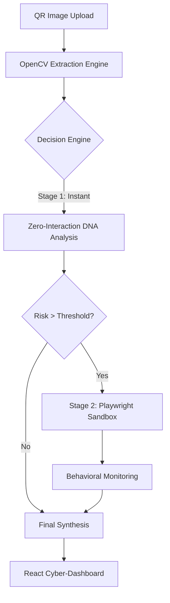

# Master Engineering Specification: QR Zero-Interaction Threat Intelligence System (QR-ZITIS)

**Version:** 1.2.0  
**Status:** Implementation Complete  
**Confidentiality:** Engineering Internal  

---

## 1. Executive Architecture Overview
The **QR-ZITIS** platform is built on a "Defense-in-Depth" architecture. It decouples initial data extraction from behavioral analysis to maximize security and minimize performance overhead.

### 1.1 High-Level Architecture Flow

---

## 2. Comprehensive Tooling & Dependency Matrix

| Component | Tool / Library | Purpose |
| :--- | :--- | :--- |
| **Backend Framework** | FastAPI (Python) | High-concurrency async REST API. |
| **Computer Vision** | OpenCV (cv2) | Self-contained QR matrix decoding. |
| **Sandbox Engine** | Playwright | Isolated browser execution & behavior tracking. |
| **Frontend Framework** | React (Vite) | Modern, optimized SPA framework. |
| **Styling Engine** | Tailwind CSS v4 | CSS-first utility styling for cyber-theme. |
| **Animations** | Framer Motion | Smooth UI transitions and micro-interactions. |
| **Data Viz** | Chart.js | Dynamic risk gauges and telemetry charts. |
| **Persistence** | SQLite / SQLAlchemy | Historical scan storage and threat profiling. |

---

## 3. Team Resource Allocation (4-Member Team)

To ensure maximum efficiency, the project is divided into specialized domains:

### **Member 1: Backend & Security Lead**
- **Responsibilities**: 
    - Architecture of the FastAPI REST layer.
    - Implementation of the **Zero-Interaction DNA Engine** (Entropy/Keyword analysis).
    - API Security and CORS management.
- **Key KPIs**: API Latency < 100ms, Entropy accuracy > 95%.

### **Member 2: Sandbox & Automation Engineer**
- **Responsibilities**: 
    - Configuration and hardening of the **Playwright Sandbox**.
    - Implementation of behavioral monitors (Redirect chains, script detection).
    - Screenshot orchestration and static asset management.
- **Key KPIs**: Sandbox isolation integrity, Redirect hop tracking accuracy.

### **Member 3: Frontend & UX Architect**
- **Responsibilities**: 
    - Design and implementation of the **Cyber-Dashboard**.
    - Integration of **Framer Motion** and **Chart.js** visualizations.
    - Responsive design and state-driven navigation flow.
- **Key KPIs**: First Meaningful Paint < 1s, User Engagement metrics.

### **Member 4: Integration & Data Specialist**
- **Responsibilities**: 
    - Database schema design (SQLAlchemy) and scan history management.
    - Final report synthesis and the "Behavioral Storytelling" engine.
    - End-to-end QA, unit testing, and Git workflow management.
- **Key KPIs**: Database query performance, System-wide test coverage.

---

## 4. Detailed Implementation Roadmap

### **Phase 1: Foundation (Sprint 1)**
- Initialize FastAPI and React environments.
- Establish the OpenCV-based QR extraction pipeline.
- Define shared Pydantic models for cross-service communication.

### **Phase 2: The Intelligence Core (Sprint 2)**
- Build the **Pre-Analysis DNA Engine** (Entropy, TLD risk).
- Setup the **Playwright Sandbox** with initial behavioral listeners.
- Implement the SQLite database layer for persistence.

### **Phase 3: Visualization & UX (Sprint 3)**
- Develop the 3-page React flow (Scan -> Predict -> Dashboard).
- Integrate Tailwind v4 theme and custom cybersecurity UI components.
- Implement real-time risk gauge telemetry.

### **Phase 4: Synthesis & Hardening (Sprint 4)**
- Connect the Pre-analysis scores to the Sandbox Decision Engine.
- Finalize the "Explanation Story" logic and Attack Graph visualization.
- Conduct final security audits and documentation finalization.

---

## 5. Risk Assessment & Mitigation
- **Risk**: Sandbox overhead slowing down UI.
- **Mitigation**: Implement async background tasks; return Pre-analysis results instantly while sandbox runs.
- **Risk**: Missing DLLs for QR decoding on Windows.
- **Mitigation**: Switched to `cv2.QRCodeDetector` to eliminate external system dependencies.

---
**Document Generated By:**  
*Senior Software Engineering Lead - QR-ZITIS Team*
